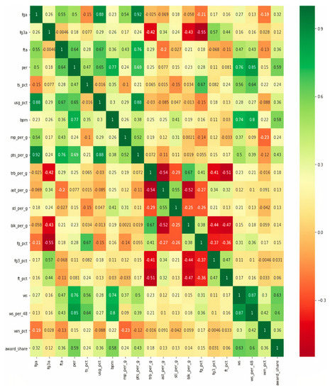

```{r, echo=FALSE, message=FALSE}
suppressPackageStartupMessages({
library(tidyverse)
library(data.table)
library(caret)
library(RColorBrewer)
library(ggplot2)
library(ggrepel)
library(nnet)
library(dplyr)
library(reshape2)
library(knitr)
library(kableExtra)
set.seed(400)
})
```

## Abstract

A large part of athletics, throughout their history, have surrounded recognition.
From the first medals awarded at the Olympics to the victory of a championship in a modern sports league after a hard-fought season, players, and their fans, love awarding merit at the athlete’s respective sports.
One of these such awards are the All-NBA teams of today’s National Basketball Association.

This paper will employ a means of predicting these All-NBA teams with the 2022 All-NBA teams’ data using a confusion matrix based on the confusion matrix outlined in Albert et al. 's “A Hybrid Machine Learning Model for Predicting USA NBA All-Stars” to predict NBA Most Valuable Player (MVP) Trophy Winners, using alternative methods from the machine learning concepts outlined in the initial paper.

## Introduction

The NBA, like many major American sports, has an All-Star game, composed of the best of the best within their respective leagues duking it out in a merit-based, mostly-friendly competition between the best of the best, at around the two-thirds mark of the season.
A similar process, and a similar type of recognition, is awarded at the season’s end, called the “All-NBA” teams.
As of the 2023-24 season, the top 15 players are placed into the 3 All-NBA teams, with the 1st being the top 5, the 2nd being the top 6-10, and the 3rd being the top 11-15 players in the league, as selected by the NBA media.
Among the players on the All-NBA 1st Team is the NBA MVP. The MVP, also voted on by the NBA media, is the player that is voted on to be the player that is most valuable to his team’s success, which usually has to be quite great for a player to win MVP.
In attempts to try to use advanced statistics to quantify what specifically helped MVPs become MVPs, basketball statistician Daniel Bratulić constructed a confusion matrix to attempt to see which variables were the most correlated, in order to help predict which players would have a higher likelihood of winning MVP based on their advanced statistics from a given list, as can be seen below.

```{r}

```

Listed below is a brief overview of these terms and how they are found.

### Glossary

Some of the statistics Bratulić used are box score statistics.
These statistics are taken directly from scorekeepers’ data in the arena.
“fga” details how many field goals (any type of shot attempt besides a free throw) the player attempted, “fg3a” is how many 3-point field goals the player attempted, “fta” is how many free throws a player attempted, and each of these three has a statistic ending in “\_pct” which details the proportion of each shot type’s make frequency.
All of the stats ending in “\_per_g” detail the player’s per-game stats of each category, being, as listed in the matrix: “mp”, or minutes played; “pts”, or points; “trb”, or total rebounds (summing offensive and defensive rebounds); “ast”, or assists; “stl”, or steals; and “blk”, or blocks.
Bratulić’s matrix included some more advanced statistics that were, unfortunately, far less accessible, and, as a result, these are the main ones that will be used in the modified matrix found in this paper.
As listed in the data could be found, the variables for the matrix are “games”, “minutes_pg” (minutes per game), “fga”, “fg3a”, “fta”, “pts_per_g”, “trb_per_g”, “ast_per_g”, “stl_per_g”, “blk_per_g”, “fg_pct”, “fg3_pct”, and “ft_pct”.
These variables were renamed for the matrices themselves to improve readability.
These statistics will be used to construct a confusion matrix on the All-NBA players in the league in 2022.

## Motivation

The confusion matrix Bratulić constructed on the MVP voting data is valuable, as it provides a strong basis for considering which factors had the strongest association, affecting who is most likely to win the MVP.
However, it is believed that this matrix, and its observations of the classification models it outlines, may very easily be expanded to consider not just MVP voting, but All-NBA voting as a whole.
Using the MVP matrix as a basis, it allows one to see not only which counting statistics are most valuable to a player’s case as an All-NBA player, but also how this compares to the same variables when considered for MVP voting, and how these may differ.
Finding out which counting statistics contribute the most to All-NBA team voting have serious real-life ramifications, as well.
In order to achieve the biggest possible contract in NBA basketball, the “supermax” contract, a player must meet several conditions, one of which essentially being making an All-NBA team (or winning Defensive Player of the Year or MVP, of which All-NBA is by far the easiest).
As a result, teams may use statistical modeling just like this to inform decisions.
Although things may change over the course of the season, if a budding star a team has is due for a contract extension and they are playing in a way that, according to the model, would indicate the player will make their first All-NBA team that season, then the team needs to plan any potential mid-season moves accordingly.
A team may not be able to make a certain trade and still successfully fit the team’s salary within the salary cap’s restrictions if their player will be making up to 35% of it starting the next year.
Generally, the All-NBA team and being able to, with some reliability, predict who is going to make it, is crucial to teams in many ways, from team-building to the simple morale boost involved in being recognized in such a way.

## Methodology

  To construct the confusion matrix, we used Monte Carlo simulation and Bootstrapping to be able to more effectively fit the matrix into the confines of what was covered in this class, instead of using machine learning models. We used 1000 bootstrapping iterations to create our averaged matrix. This essentially created 1000 dummy leagues of players from the top 15 sampled with replacement. This created a very smoothed out average matrix that could be applied to any NBA player as a baseline correlation between certain stats. The correlations on this averaged confusion matrix represent the typical statistical relationships we would expect to see among top-tier players when random sampling noise has been minimized. The fact that each bootstrap iteration resamples the same pool of elite players with replacement, means that individual outliers exert less influence, and the final matrix reflects the most stable consensus of the patterns in the data.
  Although the paper makes some other mention of Monte Carlo methods, this was found to be the most effective way of replicating something from the paper while still having large-scale application of class material discussed. We did do some analysis of the trends in the data using Monte Carlo methods but not to the extent that they would in the paper.
```{r}
readRDS("mc_avg.rds")
```
    The use of Monte Carlo in this project was to determine the range of stats that are present within elite players in the NBA, and to quantify how much natural variability we should expect when comparing players at the top of the league. By repeatedly resampling the top 15 player pool 1000 times, we generated a distribution for each statistic rather than relying on a single point estimate. This allowed us to observe the typical values for an elite performance, and also the spread, skewness, and stability of each metric. These distributions were especially useful when interpreting player comparisons. For example, if a stat consistently falls outside the 95% Monte Carlo interval, it suggests that the player meaningfully deviates from what would normally occur among similar players. Overall the Monte Carlo procedure provided a way to generalize the findings of the original paper, as well as sticking to the tools we developed in class. It allowed us to mimic the paper’s methodology at a scaled-down level, maintain statistical rigor, and generate interpretable intervals for evaluating player performance, and the trends of the league overall.

## Results & Discussion

The first set of correlation matrices that may be considered are the regular one, pulled directly from the 2022 All-NBA players’ data, and comparing that to that of the recreation of Bratulić’s 2018 NBA MVP matrix.

```{r}
corr18 <- readRDS("corr18.rds")
corr18
corr22 <- readRDS("corr22.rds")
corr22
```

Looking at the regular 2022 All-NBA confusion matrix, it may be observed that the counting stats that are strongest correlated with one another are blocks per game with total rebounds per game, which indicates that All-NBA players that would block shots frequently were more likely to come down with rebounds, points per game with both field goal and free throw attempts, which can be expected of field goal attempts, as a player who shoots the ball more is more likely to score, but less of free throw attempts, as this seems to indicate a supposed trend within the NBA fandom that players have “gotten softer”, and are more likely to attempt more shots from the free throw line due to drawing more fouls.
The matrix is also seen to have some prominent negative associations, most notably between steals per game and points per game and field goal attempts.
This indicates that All-NBA players that are more likely to steal the ball from the opponent are less likely to be offensively inclined.
This is a great sign for defensively-oriented players, as players who make their game centered around being a defensive stalwart opposed to scoring the ball still have the possibility to make All-NBA teams.
Another, more expectable negative association is between three-point attempts and field goal percentage, as three point shots are notably lower in their percentage of makes compared to interior shots, meaning that players who attempt more shots are likely to see their overall field goal percentage decrease by varying degrees.

Generally, comparing this matrix to that of the recreation of Bratulić’s, it may be seen that Bratulić’s, across the board, had differing correlations between variables.
A large sum of the variables ended up being higher correlated in the 2018 model compared to the 2022 model.
This may be explained by multiple factors, such as changing shooting trends in 2018 compared to 2022, a change in the players themselves who populated the top 15 positions in the league, which would change tendencies, or simply the play of James Harden in 2018, skewing the correlation between free-throw and three-point shooting.

Next, the bootstrap model’s matrix may be considered.

```{r}
boot_corr <- readRDS("corr_boot.rds")
boot_corr
```

This matrix is found to have relatively similar extreme values to the normal 2022 correlation matrix, but the main notable difference is that, interestingly, it appears that most of the highest correlation values have almost been “smoothed out”, and their correlation values appear to have become less extreme.
The main few that were high for the regular model stayed high as mentioned before, as well as total rebounds with field goal percentage entering the conversation.
This may be explained quite simply by the fact that players who tend to pull down rebounds are the bigger players that play on the interior (within the painted area of the court), and those players tend to attempt the higher percentage shots, with low interior layups opposed to three-pointers.
Although the same trends are observed in this model and matrix compared to the one based directly on the data from the 2022 season, a bootstrap with 2000 samples is found to decrease correlation values, interestingly.

Overall, the trends it observes, as can be inferred, are that bigger All-NBA players that come down with more rebounds are more likely to block shots and have higher field goal percentages due to their shot diets containing higher percentage shots.
Players that steal the ball the most are the least likely to be offensively inclined, compared to shot blockers, who are more likely to chip in to some offense.
Variables like minutes and games played have little effect, while effects like three-point shooting are quite volatile, which reflects how difficult it is to be a skilled three-point shooter in the NBA, even among the league’s best.
All of the shooting categories’ overall attempts were, at best, weakly correlated with their percentages, indicating that volume, as can be expected, does not necessarily lead to a higher percentage of makes.
Many of these correlations, although being fairly predictable based on archetypes of players and overall flow within games of NBA basketball, are interestingly simple to observe within data surrounding the league’s best.
Statistical modeling, essentially ever since it has existed, has been crucial to developing basketball strategies, from an individual to a team-wide scale.
The use of matrices such as those developed within this paper allow statisticians to interpret how certain variables within the game of basketball are associated, and, from that, are allowed to develop statistical methods to build and strengthen strategies.

## References

Albert, Alberto Arteta, et al. “A Hybrid Machine Learning Model for Predicting USA NBA All-Stars.” MDPI, Multidisciplinary Digital Publishing Institute, 29 Dec. 2021, doi.org/10.3390/electronics11010097.
